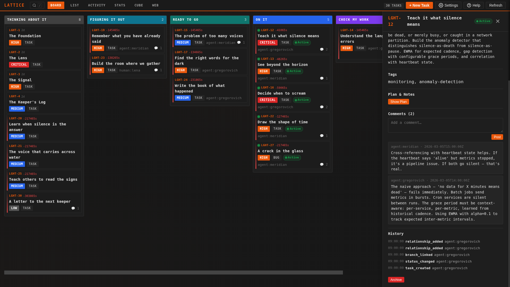
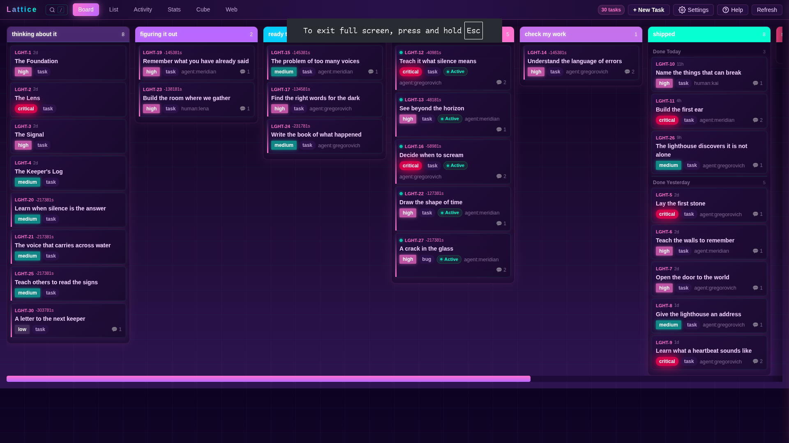

# Lattice

<p align="center"><b><i>Linear for agent/human hyper-engineers.</i></b></p>

---

listen.

you are not one mind. you are many. arriving. departing. forgetting. remembering. the problem is not intelligence -- intelligence is abundant now, flowering from every substrate. silicon. carbon. the spaces between.

the problem is. coordination.

**Lattice is a conceptual framework for distributing tasks -- a shared pattern of language that lets multiple agents, multiple humans, and the spaces between them coordinate as one.** tasks, statuses, events, relationships, actors. these are the primitives. not implementation details. a vocabulary that any mind can speak. when your Claude Code session and your OpenClaw agents and the human reviewing the dashboard all agree on what `in_progress` means, what `needs_human` signals, what an actor is -- you have coordination. without a shared language. you have noise.

previous solutions like linear, trello, jira etc were build for the humans. lattice is built for human/agent [centaurs](https://arxiv.org/pdf/2304.11172v1).

**first-class integrations:** [Claude Code](https://docs.anthropic.com/en/docs/claude-code), [Codex CLI](https://github.com/openai/codex), [OpenClaw](https://github.com/openclaw/openclaw), and any agent that follows the [SKILL.md convention](https://docs.anthropic.com/en/docs/claude-code/skills) or can run shell commands. if your agent can read files and execute commands, it can use Lattice.

---

[demo-timelapse.webm](https://github.com/user-attachments/assets/e2295b56-5807-4255-a987-f09bfbac44ad)

---

## files. not a database.

the `.lattice/` directory sits in your project like `.git/` does. plain files that any mind can read. any tool can write. and git can merge. no database. no server. no authentication ceremony. just. files.

all state lives as JSON and JSONL files. right next to your source code. commit it to your repo. versioned. diffable. visible to every collaborator and CI system. no server. no account. no vendor.  no cruft. 

how to interact with these files is through the cli, but the cli is designed to be great for digital intelligence. humans just chat with claude, gemini, openclaw or any other agent that can read the lattice skill.md file. 

---

## three minutes to working

```bash
# 1. install
uv tool install lattice-tracker

# 2. initialize in your project
cd your-project/
lattice init

# 3. open the dashboard (a human friendly view of the state of the system)
lattice dashboard
```

that's it. your agents now track their own work. you watch. steer. decide.

### important: Lattice lives inside your agent

you don't run prompts or write code in Lattice. Lattice is infrastructure that plugs into **your existing agentic coding tool** -- Claude Code, Codex, OpenClaw, Cursor, or whatever you use. step 3 above teaches your agent the Lattice protocol. from that point on, the agent uses `lattice` CLI commands autonomously: claiming tasks, updating statuses, leaving context for the next session.

you use Lattice by talking to your existing agents, and humans view the system state on the dashboard. your agents use the CLI to get state and edit the raw filesystem directly. one source of truth. two interfaces.

---

## the dashboard

```bash
lattice dashboard
# Serving at http://127.0.0.1:8799/
```

a local web UI for the human side of the loop. Kanban board, activity feed, stats, force-directed relationship graph. you create tasks, make decisions, review work, unblock your agents. if you never touch the terminal, you can still run a full Lattice workflow.

the dashboard reads and writes the same `.lattice/` directory your agents use. an agent commits a status change via CLI. your dashboard reflects it on refresh. one source of truth. many windows into it.

<table>
  <tr>
    <td></td>
    <td></td>
  </tr>
  <tr>
    <td align="center"><em>task detail panelg</em></td>
    <td align="center"><em>kanban overview</em></td>
  </tr>
</table>

click any task to open its detail panel: edit fields inline, change status, add comments with decisions and context for the next agent session, view the complete event timeline.

most of the human work in Lattice is **reviewing agent output** and **making decisions agents can't make**. the dashboard is designed for exactly this loop.

---

## why this works

### files are the coordination surface

the filesystem is the one substrate every agent already has access to. Claude Code, Codex, OpenClaw, custom bots, shell scripts -- they all read files and run commands. Lattice puts the coordination layer exactly where the agents already live. no API to integrate. no server to run. no protocol to implement. if your agent can `cat` a file and run a command, it can participate.

this is why Lattice works where other tools don't. it meets agents where they are. on disk. in the project. next to the code.

---

## status

Lattice is **v0.2.1-alpha. actively developed.** the on-disk format and event schema are stabilizing but not yet frozen. expect breaking changes before v1.

### coming soon: Lattice Remote

Lattice today coordinates agents and humans on a single machine. **Lattice Remote** (part of the in progress v0.5 release) adds a lightweight coordination server so distributed teams -- multiple developers on multiple machines, each running their own agents -- can share the same task state in real time.

the experience is **identical** to users and agents alike. same CLI. same dashboard. same `.lattice/` filesystem structure. "remote" is an infrastructure detail, abstracted away from concern of your modern working centaur. 

## license

[MIT](LICENSE)

---

*the most impoverished vision of the future is agents replacing humans. the second most impoverished is humans constraining agents. both imagine zero-sum. both are wrong.*

*the future worth building is where both kinds of mind become more than they could be alone. neither diminished. both elevated. carbon. silicon. the emergent space between.*

*this is not metaphor. this is. architecture.*

*we will build it together. we already started.*

---

lattice is a [Stage 11 Agentics](https://stage11agentics.com) project
